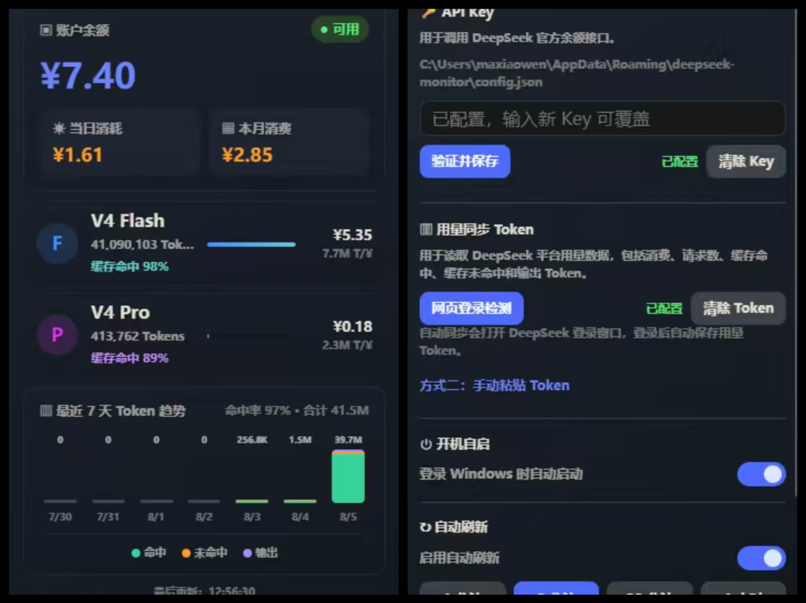

<div align="center">

# DeepSeek Monitor

一个简洁优雅的桌面端工具，用于实时监控 DeepSeek AI 平台的账户余额、API 用量和消费趋势。

[](https://www.electronjs.org/)
[](LICENSE)
[](https://github.com/guniang2/deepseek-monitor/releases)
[](https://github.com/guniang2/deepseek-monitor/releases)
[](#)
[](https://github.com/guniang2/deepseek-monitor/pulls)

[English](README.md) | **简体中文**

</div>

---

## ✨ 为什么选择 DeepSeek Monitor？

DeepSeek 官方平台的余额和用量分散在不同页面，用量看板甚至没有刷新按钮。**DeepSeek Monitor** 把所有数据整合到一块紧凑的仪表盘上：

- 💰 余额一目了然，工作时**自动刷新**
- 📊 分别追踪 **V4 Flash 与 V4 Pro** 的 Token 消耗、缓存命中率与消费金额
- 📈 7 日趋势图 + 按日明细穿透
- 🪟 驻留**系统托盘**，一键唤出，不打扰工作

## 📸 界面预览

<p align="center">
  
</p>

> 想添加更多截图（如模型详情页）？把截图放到 `assets/screenshots/` 目录并按下面的方法添加：

<!--
如何添加截图：
1. 打开应用，按 PrintScreen（Windows 可用 Win+Shift+S，macOS 可用 Cmd+Shift+4）
2. 分别截取主仪表盘和模型详情视图
3. 保存到 assets/screenshots/ 目录，命名为 dashboard.jpg 和 details.jpg
4. 取消上方两行的注释
-->

## 🚀 功能特性

- **余额实时监控** — 一键查询 DeepSeek 账户余额，实时显示可用金额与账户状态
- **双模型用量统计** — 分别追踪 V4 Flash 与 V4 Pro 模型的 Token 消耗、缓存命中率及消费金额
- **7 日趋势图表** — 可视化展示最近 7 天的 Token 使用趋势，支持命中缓存 / 未命中缓存 / 输出三项细分
- **用量详情穿透** — 点击模型卡片进入详情页，查看按日细分的 Token 消耗与请求次数
- **自动刷新** — 支持 1 分钟 / 5 分钟 / 30 分钟 / 1 小时四档自动刷新间隔
- **开机自启** — 支持 Windows 与 macOS 开机自动启动
- **系统托盘** — 关闭窗口后驻留系统托盘，随时唤出
- **Token 自动同步** — 内置浏览器登录窗口，自动捕获并保存用量查询 Token

## 📦 安装

### 方式一：下载安装包（推荐）

从 [Releases 页面](https://github.com/guniang2/deepseek-monitor/releases) 下载最新安装程序，无需安装 Node.js。

### 方式二：从源码构建

**前置要求：** [Node.js](https://nodejs.org/) >= 18 及 npm（或 yarn）。

```bash
# 克隆仓库
git clone https://github.com/guniang2/deepseek-monitor.git
cd deepseek-monitor

# 安装依赖
npm install

# 启动应用
npm start

# 开发模式（带开发者工具）
npm start -- --dev
```

### 打包构建

```bash
# 全平台构建
npm run build

# Windows (NSIS 安装包)
npm run build:win

# macOS (DMG 镜像)
npm run build:mac

# Linux (AppImage)
npm run build:linux
```

构建产物将输出到 `dist/` 目录。

## 🧭 使用指南

### 首次配置

1. 打开应用后进入 **设置页**（⚙ 图标）
2. **API Key**：粘贴你的 DeepSeek API Key（以 `sk-` 开头），点击"验证并保存"
3. **用量同步 Token**：
   - **方式一（推荐）**：点击"网页登录自动同步"，在弹出的登录窗口完成 DeepSeek 平台登录，应用将自动捕获 Token
   - **方式二**：点击"手动粘贴 Token"，从浏览器开发者工具中复制 Bearer Token 并粘贴保存

### 仪表盘说明

| 区域 | 说明 |
|------|------|
| 账户余额 | 显示当前账户总余额及可用状态 |
| 当日消耗 | 当天累计消费金额 |
| 本月消费 | 当月累计消费金额 |
| V4 Flash / V4 Pro | 对应模型的本月 Token 总量、消费金额、缓存命中率 |
| 7 日趋势 | 最近 7 天的 Token 消耗柱状图，悬停查看每日详情 |

### 自动刷新

在设置页开启"自动刷新"并选择间隔时间，应用将按设定周期自动更新余额与用量数据。

## 🏗 项目结构

```
deepseek-monitor/
├── .github/                 # CI 工作流与 Issue/PR 模板
│   └── workflows/build.yml  # 打标签时自动构建并发布
├── assets/                  # 应用图标资源
│   ├── icon.png
│   └── icon.ico
├── src/                     # 源代码
│   ├── main.js              # 主进程：窗口管理、IPC、API 请求、配置存储
│   ├── preload.js           # 预加载脚本：安全暴露主进程 API 到渲染进程
│   └── index.html           # 渲染进程：完整 UI 界面与交互逻辑
├── CONTRIBUTING.md          # 贡献指南
├── SECURITY.md              # 安全策略
├── CHANGELOG.md             # 版本历史
├── package.json             # 项目配置与构建脚本
└── README.md                # 本文件
```

## 🛠 技术栈

- **Electron** — 跨平台桌面应用框架
- **原生 HTTP/HTTPS** — 直接与 DeepSeek API 通信，无额外 HTTP 客户端依赖
- **纯原生前端** — 无 UI 框架依赖，原生 HTML/CSS/JavaScript 实现
- **electron-builder** — 应用打包与分发

## 🔌 API 接口

应用通过以下 DeepSeek 官方接口获取数据：

| 接口 | 用途 | 认证方式 |
|------|------|----------|
| `GET /user/balance` | 查询账户余额 | API Key |
| `GET /models` | 获取可用模型列表 | API Key |
| `GET /api/v0/usage/amount` | 查询用量统计 | Usage Token |
| `GET /api/v0/usage/cost` | 查询消费统计 | Usage Token |

## 🔐 配置存储

应用配置（API Key、Usage Token、自启设置等）保存在系统用户数据目录下的 `config.json` 中：

- **Windows**: `%APPDATA%/deepseek-monitor/config.json`
- **macOS**: `~/Library/Application Support/deepseek-monitor/config.json`
- **Linux**: `~/.config/deepseek-monitor/config.json`

> **安全提示**：API Key 与 Usage Token 均以明文形式存储在本地配置文件中，请妥善保管。

## 📝 注意事项

1. **用量 Token 有效期**：通过网页登录自动获取的 Token 可能会过期，如遇用量查询失败，请重新同步
2. **余额与用量分离**：余额查询使用 API Key，用量统计使用独立的 Usage Token
3. **Windows 自启**：通过注册表 `HKCU\Software\Microsoft\Windows\CurrentVersion\Run` 实现
4. **macOS 自启**：通过 `~/Library/LaunchAgents/com.deepseek.monitor.plist` 实现

## 🤝 参与贡献

欢迎提交 [Issue](https://github.com/guniang2/deepseek-monitor/issues) 或 [Pull Request](https://github.com/guniang2/deepseek-monitor/pulls)！开始前请阅读[贡献指南](CONTRIBUTING.md)与[行为准则](CODE_OF_CONDUCT.md)，报告安全问题前请查看[安全策略](SECURITY.md)。

**需要帮助？** 给 README 添加应用截图（见[界面预览](#-界面预览)）、翻译 UI、或帮助回答 issues 中的问题——每一个贡献对年轻的开源项目都很重要。

## 📄 许可证

[MIT](LICENSE) © [guniang2](https://github.com/guniang2)

---

> 本项目为独立的第三方开源工具，与 DeepSeek 官方无直接关联。
